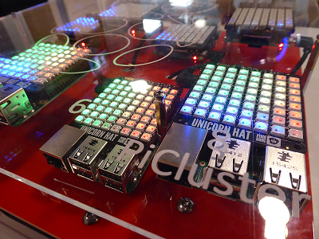

# Build an OctaPi

In this resource you will make a distributed computer system using:

- eight Raspberry Pi 3 computers acting as **servers**
- another Raspberry Pi 3 acting as **client** which will control the servers

This is known as a **cluster computer**, a kind of cloud computer. The power of the eight server CPUs (32 cores) will allow you to execute computations from the client CPU much faster than the client could perform them on its own. Once you complete this project, you will be able to develop applications in Python 3 on the client and run them on your cluster.

There are three steps you will need to take to make an OctaPi:

- Create a Wi-Fi network for the cluster using a dedicated router
- Create a client machine
- Create eight servers

**NOTE:** You don't actually need exactly eight servers, as the cluster will work with any number of servers up to limits determined by the performance of your Wi-Fi router. If you don't have enough Raspberry Pis available to make an OctaPi, why not make a HexaPi (6) or a TetraPi (4)?

If you want to make your cluster look pretty, you can optionally fit Pimoroni Unicorn HAT 8x8 LED arrays to each server. The bash control script on the client machine can be used to change the patterns on the Unicorn HATs.

## Licence

Build an OctaPi by [GCHQ](https://www.gchq.gov.uk/) and the Raspberry Pi Foundation is licenced under a Creative Commons Attribution 4.0 International Licence.
Based on a work at [https://github.com/raspberrypilearning/rpi-python-build-an-octapi](https://github.com/raspberrypilearning/rpi-python-build-an-octapi)

**Code and scripts**
Copyright: [Crown Copyright](https://www.nationalarchives.gov.uk/information-management/re-using-public-sector-information/uk-government-licensing-framework/crown-copyright/)
License: [Apache 2](https://www.apache.org/licenses/LICENSE-2.0)
